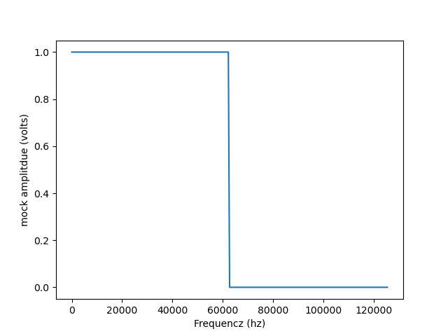

# AVR Bare-Metal DDS Engine
Implementation of a Direct Digital Synthesis signal chain using custom AVR drivers.

1. The Signal Chain (DDS Logic)

- Data Formatting: Converting Cosine/Sine waves into 8-bit Intel Hex format.

- Validation: Custom hex-file address validation logic.

- EEPROM Integration: Writing validated hex data directly to EEPROM for waveform storage.

- Synthesis: Implementing a Phase Accumulator utilising the hardware clock.

- Output: Accessing memory via the phase accumulator to drive the on-board DAC (PWM) and hardware filtering.

2. Critical Hardware Configurations
Key manual overrides for bare-metal stability:

- Clock Management: Direct CLKPR writes (0x80 -> 0x00) to force full 16MHz operation.

- Stack Initialization: Manual pointer setup (SPH = 0x08, SPL = 0xFF) within AVR_DRIVER_INIT.

- Memory Safety: Buffer-size validation to prevent data spilling from the loader into Phase Accumulator variables.
# Calculations 
The timer goes from 0 to 255 
form the atmega we get the following output for the frequency that the output of  the PWM 

$$f_{\text{OCNXPWM}}=\frac{f_{clk\_I/O}}{N X 256}$$

we use the clock in idle mode we have the following : 

$$\frac{16 MHz}{255}=62745 hz$$ 

That means that we are triggering every 15.9375 micro seconds. Now we have to design our filter
## Filter design 
For this project, our ideal cut of frequency is 62.725 kHz, which would look like the graph below:

In the real world, it is  almost impossible to have sincroll off. This is due to every circuit acting like it has inductance  and capacitive attributes 
For this small project, we are just going to use a low-pass filter with a 4k ohms resistor, as they are easy to get using the following formula :

$$6.2745_{kHz}=\frac{1}{2\pi 1k_{ohms}C}\space \therefore C \approx 25.37_{nF}$$

## Timer Initialisation
### PWM 
- In order to get the right frequency i set the timer frequency to $16_{Mhz}/64$ 

- with this its recommend to set FSW to 6

$$\frac{6x10^3(2^8)}{\frac{16x10^6}{64}} \approx 6 $$
### Watchdog Timer
In this project, I want to ensure speed, and half of this is confirming how long does it takes per line of code to execute. At first ill set it to 64ms 
